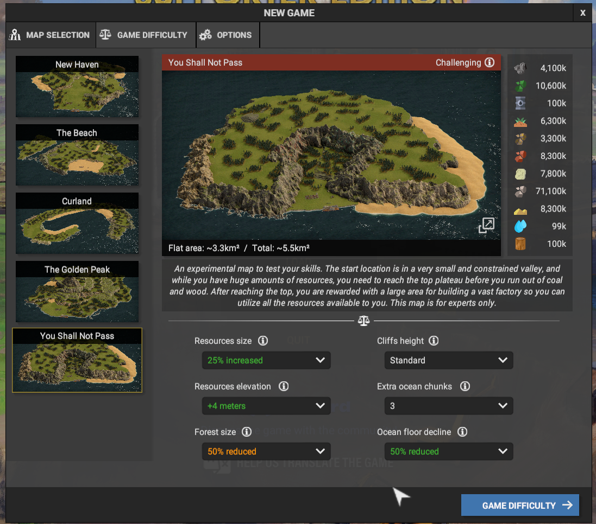

# README

I intend to put various captain of the industry things related. the game has inspired such a flurry of thought for me that I want to begin to organise it.

### save format

I'm still experimenting with the format for save files. I'm between two designs still. most of the saves either don't have a format or are useing one of these.

#### code- x.y.z-n - feature

`x` is the major version of the map. I think of the map as a build order, so I kinda have a flow in my mind of things that need to be accomplished. each `y` is a major version in that system, and `x` are just incremental saves along the way which may be only a few months apart. `n` features are small changes that were made to the save file without unpausing the game (like forgot to turn something on)

#### code- subsystems - x.y.z-n

in this one, I for the map, I have different subsystems, which have sort of like milestones to them. I set out to build certain objectives in the form of subsections. for example, on the map yshnp, I've found that a basic distillery in the back is good for getting things started, but then I want to build a simple adv diesel system, but later I want an 8x adv diesel system (those are version 1, 2, and 3). for production, I found that 8 factories in a row is good. this is a good investment for my cp2 early on because I'll have a lot of time and trees to kill, and makes future expansion faster with enhanced cp production.

the thing I notice with this one is when I look at the saves list after loading a save, I can't really figure out where I am. I'm thinking about adding at least the year and perhaps month.

#### code- yyyy.m feature

this is the format I'm using for the latest incarnation of q- I find it a lot easier to see what save I'm doing, going by year. I do want to incorporate a branch into it, so probably I'll make all of them mainline, then branch off with a different code.

---

## new haven

hated it from the first time I played it. played it again with jaron the one time, and even though it was on sailor, it was still too easy and gave me a weird vibe I didn't like. it felt like I was connected to the other noobs that are looking at "such a complex game" and can't figure out what is fun about moving sand around on an unbelievably contrived map. the map is contrived, but not in a good way like crater or ysnp.

## circular

I can't remember, but I think it was too easy so I ditched it.

## crater

I loved this map, but I can't tell it to go at a height *above the terrain* so it's not like the belt/pipe would follow the terrain (like a roller-coaster). as such, it was impossible to do ramps. when ramps and building on s slope is reworked, I really want to revisit this map. it gives me such a good vibe and I just love tunneling down deep into a coal mine to get to a farming sort of flatland. in my imagination, I picture the piace a little more jungly, so I'm like passing this cool lookout point and then descending down this coal mine into the lush gardens (greenhouse 2) downstairs.

I think this is my favourite map for layout and difficulty because of the difficult placement andr long distance between iron/coal and copper.

## c-

my first attempt at ysnp. I got pretty far and am pretty stable. things are pretty fine and I can win the map if I take it a bit slower. I have hundreds of years on the crude deposits to get the vp2 for crude setup on the beach. I'll probably take the whole thing down to 1 and then lay a layer of rock so it looks nice and has sharp ocean edges.

in this one (my 1-2nd attempt), I mainly didn't do a whole lot of loading. I played through trying to save and load more. I really like how it is when I just go through and play it. I'm really starting to like just freestyling it, not really planning too much and just going for it. this is the play style that I'll eventually adopt. the replay mode is good for practise, but it's a lot of fun to just go for hours without saving or loading. it's kinda like freedom. my goal is to get a build order such that I can kinda just execute it. the game isn't really ready for this style of play yet, because some of the more common tasks are still quite tedius

## p-

my second attempt at ysnp (or is it third). this is about the time that I wanted to get a more solid early game technique. I played this map on -20% forest and admiral difficulty. the forest was actually to make it easier. at normal bush, it takes FOREVER to give the inner section there a brazillian. everyone loves a shaved map. so, I reduce the forest to clear up space real quickly. it's pretty easy to import wood from the sawmill.

## p- (named the same until I sort them)

this is the one I'm playing now. it's probably at least the 4th attempt. I wanted to focus on my perhformance and technique. in this one and in crater, I would go along saving (not frequently) and just see how far I could get before it fell apart. this one, I"m trying to optimise my CP prodruction, because a build needs to flow, and I can't have large gaps where I can't build something cause I don't have parts. this means I work on more things at once, doing smaller incremental improvements.

the short term goals are to bring the whole inner section down to 2 and haul the dirt out to the front and make a dock on the side there (dirt) and use rock to make some piers on the beach to the left. I'll dig it out and consume the sand for a massive glass + VP2 (for crude) and a good construction parts setup. on the left there I'll be throwing the mountain into the sea and building a sour water, hydrogen and electronics setup there. OH right, and because there is so much gold, I'm just gonna go heavy gold mining for crude on the left side.

#### left side

- gold for crude
- slag for sour water -> hydrogen and quartz and then later microprocessors.
- settlement will rely mostly on chickens and sausages because they're easy to make.
- diesel installation to turn crude mostly into FG. all extras get turned into FG anyway, and I plan to run quite a large diesel setup here, importing lots and lots of crude (for gold), and it'll power lots and lots of power plants with that FG -> hydrogen, and then because I have lots of people (dual--or triple if I don't aboandon the original), I'm going to turn all of that depeleated steam into water. people and farms are thirsty, so they can drink the hydrogen that powers their household appliances. lots of diesel to turn into lots of hydrogen.

#### right side

- VP2 for crude. huge iron production facility. it'll have redundant copper production, but mostly just to not have to import from the left side. they'll also have HA for copper (for their settlement and for getting copper)
- also slag for sour water
- this one will probably also do chickens, because they're very efficient for many peole they feed. with fertilizer, 4-6 greenhouses can feed probably 10k people with chickens. that's only 200-300 water and then anther 200-300, so not much. easy to make, again from the power to water idea. it's more cost effective to use desal for water, considering that people, with a proper food setup are really not a problem at all. high population good.
- dunno, other stuff

the resume is that the beach side is gonna be heavy into iron and construction parts (cause of limestone and sand), the gold side into gold, oil, and microprocessors.

#### front centre

- I'll probably keep this little settlement. I don't intend for it to grow beyond 800 or so. it'll probably spread toward the left there. the part back of the coal mine is where I want to put the second settlement, becasue it'll probably grow bigger.
- the rest of the island will run off of contracts importing all of the things that it needs, but I intend to keep this section around (paused) with mining reserves to be able to bail out if contracts don't work or something.
  - in reality, this a fanciful idea because I'll obviously reload the save, instead of activate an emergency failsafe. it's fun for me to play the game as if there are additional stresses, as if this was the production for a larger military operation. as such, in such "real-life" situations, a loading isn't possible so I have to have these back procedures. also when I played without loading so much, I had techniques to bail myself out of situations.

## q- restart to see bricks mechanic

I restarted the game to try out the new bricks mechanic deployed in 0.4.13. it's nice that I don't have to dump dirt anymore and can turn all my dirt into bricks. I'll save my slag and turn it into sour water later with the contract.

the plan is to setup bricks and dirt to run as a backup to the concrete system. I'm going to try and run a lot of it off of bricks allowing me to get rid of dirt a lot easier. concrete is nice though because it gets rid of slag turning them into bricks. for every iron ore smelted, half of it turns into slag, so until recycling is online a lot of extra slag is created. this is good for creating concrete, and then later little slag is output, cause scrap doesn't create slag. that's the plan so far.

I these are the map settings I decided on (difficulty admiral)



while playing with these settings, I noticed is that normal elevation, the top part is at 45. this is pretty high. -25% reduced cliff heights, it's at 34 -- too easy I think. max hight I think bas 65 or 66 -- really high, and the back part of the inner area isn't even accessible and the coal needs to be mined out to even access it. I think this setting is pretty close to impossible. I wanna beat these setting first before trying that one -- I'm not *that* ambitious :).

strat changes from how I did p-:

- I will make the ramp up to the next level, now do diagonally up in iron mountain.
- I set the farms more over to the right, cause once I clear the mountain to the left, I'll have space to put in chicken farms that will feed enough that the settlement should be able to expand to 2-3k without a problem (with food saver edict, I'm actually thinking 5k+).
- instead of dumping dirt into the sea, I'm going to use it to make bricks. I'll accumulate slag, and then trade it for sour water later
- I'm going to try and not dump anything but rock into the ocean. I'm also going to try and dig up and consume all of the dirt too (only rock island eventually).
- I'm going for sustainable island, so removing all resources isn't my immediate goal, but it would be cool to realise an only rock island (minus the single layer of dirt below the farms)

gameplan:
- I'm going to first shave the entire middle part down to 5 (removing the dirt), then to 2 (removing the rock and expanding the copper smelters into electronics 2). all dirt will be used to to create bricks, and the rock to make a pier in front of the settlement. this is going to be the strat for the entire top part as well. the goal is to take all of the dirt and turn it into bricks and just use the rock to expand the island outward
- I'll ramp up to the top and shave the entire top of the map down to 40 (from 45) using all of the dirt to create bricks.
- I'll then use all of the extra rock to expand the whole island out laterally.
- parts of the island in the middle will still have dirt. that will get dug out (along with all the resources) and replaced with rock.
- final product will be a fully rock island with a massive factory.
- I want to make at least 2 settlements (one on the left and one on the right) -- but it's possible I'll be keeping the initial one in the centre there.

### 2022-12-31 18:00 - initial thoughts on new bricks mechanic

I really like it. in previous playthroughs, I didn't really know what to do with all of the dirt, so I threw it into the sea. the bricks maker requires quite a lot of maintenance (twice as much as cement) and makes half/quarter/eighth as many bricks for input (6 vs 12/24/48) so it's quite inefficient, and somewhat expensive to create, but I *really like* not having to transport the dirt all the way across the map to throw it in the sea. I'm even thinking of creating little bricks factories on to reduce the transport, because it's easy to get water and coal, and turning 12 dirt into 6 bricks nearly halves (minus coal) the amount of materials needed to be transported by the trucks.

### 2022-12-31 18:21 - performance metrics

the other day, I was thinking about taking my save files and making them into a website where other people can upload their saves, and then the save file is parsed to extract some data from it to show metrics. (kinda in speedrunning fashion)

at the moment, I'm using cp1 production as my performance metric (cause it's used for all construction). I want it to be constantly positive (ie how well the build flows), and have the biggest numbers (ie how efficient it is). for the website I want to display these numbers visually and comparatively to other saves -- so I'll take the statistics recorded in the save file and use them to calculate efficient build orders, and allow others to upload their saves and improve on existing ones. as more alternate routes get taken, I'd also like to show the saves in a network graph of branches with their efficiency.

for example, last night I did a build, and it became pretty productive, but I ran into a hiccup where I don't have space for another copper smelter and no space for iron either. so, I'm gonna prioritise mining those out tonight and see where I get.

in y69.8 I have 19479 cp1 production. which seems pretty good considering the map and difficulty, but I think I can do better. just letting the game run pretty much until y78.9 I had 21923. again, pretty good, but I think I can do better. I think I'm going to start over in y62.5 which has 16237 cp1. (I have the abandoned branch with those metrics saved somewhere if anyone wants them)

### 2023-01-01 04:21 - starting tech3

next things:
- sulfur to slag
- upgrade to assumbler 2 to save power and pops
- add another steel smelter (when the iron mountain is out of way)
- add second air separator and use nitrogen to make science2
- I'm mining more coal than I'm using. put an alarm and move over a digger to get rid of dirt on top of coal mine

I'm thinking, actually if I'm this close to t3, then I may as well just put up with the crappy diggers and research glass instead of trading cp3 for it.

I did make last night's production graph a lot smoother (though only slightly improved numbers), so I may want to improve it again tomorrow (y75-80 are kinda rough cause I had bricks/iron production problems). we'll see.

at any rate, I'm feeling really good about this run because I think I'm ~50y years faster getting tech3. I also still have 1/3 of crude oil reserve left too. it'll go fast as soon as I upgrade trucks.

(I think I'm also going to move this log over to a separate file tomorrow as well, clean it up a bit too). btw, I'm starting to keep logs of a lot more things now because I'm having such a difficult time remembering things, and I've found that writing it down improves  my recollection of it and also it's really helpful to be able to look back and search it.

### 2023-01-01 17:14 - I am so stoned

I'm just recording this, because I'll have to look at it tomorrow and I think around y75-76 I got *really stoned* and I don't think that it's going quite as smoothely as it normally does. I don't normally experience this, which is why I'm stopping. I'm starting to worry. I never worry when I'm playing, so I know it's a problem. I'm clearly picking up interference from elsewhere -- what's important though is that I recognise it.

this game is extremely mental in that I notice that the way I feel really influences how I'm playing -- so that even a little bit of tiredness really affects me; which is why I'm starting to redo (now that I'm looking at things as a sequence) the last few years every morning. what I mean is, when I wake up in the morning, my mind is fresh so I see the game usually a lot clearer than when I'm shutting down the game at 2-4am. I often times notice a whole lot of things I could do better and so what I do is redo the last few years -- just sorta start over.

there's a tremendous value to throwing things away. I learned this from andreas. he said he had a friend that would write a prototype and then just throw away the prototype and start over. I recognised this as valuable when I was programming myself, because I learned so much from the next time that I do it -- the rewrite. the thing is, you don't want to rewrite all sections, but I noticed it was a good idea to just start over and write all the code again manually. it's a bit more effort, but for example when I would watch dominic (tarr) or substack (james haliday?) they would start over with a nodejs server ... you know starting the file from empty, importing net, fs, etc. and then just starting there to show it off. they'd done so many presentations, the basic setup they figured out really well.

anyway, well, I take the same approach to this game. I like to think of my factories as accumulating technical debt with all of the pipe spaghetti. there are always more optimal ways to lay things out and stuff. there are also improvements that I can do on the timeline.

the timeline is like this lightning bolt passing through a medium. it tries in one way, goes a long enough distance to encounter enough resistance to know it doesn't want to go forward any more, so it goes back a ways and retries. every night, I try to go back and redo a few things here and there, and then during the day, I often times restart after a fail moment or I want to imporove it. each of creates a different branch. the more branches that one takes from a point, they spread out, in incompoatibility/difference to each other (more difference, more distance) in kinda a cone shape. the end result is what it looks like when lightning is passing through a medium. it's finding its least resistant path to the destination. I've always seen this as the leader.

after connection is made, now you have a timeline from start to finish, and now it's possible to go back on the timeline and redo the same things a little bit differently, creating even more branches. the more branches that are created, eventually this is a straight line -- a sequence of operations to get from one point to another point.

break time. man the scorpions are insane.

### 2023-01-02 01:29 - worry

when I say worry, I mean thinking about the things that could go wrong. in fact, I don't think about what could go wrong at all. instead, I'm only tryiny to keep everything stable meanwhile building the next thing that I want. the only forward thinking that I have really is when I'm about to move the diggers, because I'll want to be clearing the next space for my next addition to the factory.

this time, I end now evaluating my progress by simply feeling like I'm definitely feeling good about how things are progressing.
I've almost got another steel smelter, which means I can start building the lvd. once I have medium diggers, it's a complete gamechanger, as now I'll be able to mine the iron ramp easily and clear out the mountains on the left side and use that new space next to the tech. making the space on the beach will be really good so that I can start on glass production. flatening the beach will put in a cargo depot which will do the coal for cement contract. keep expanding the beach and putting in rows of coal power plants. I have TONS of limestone to mine and with the contract basically unimited power and cement...

### 2023-01-02 04:06 - looking good

I went extra long before quitting here. I'm going to restart this one, but even with such a disaster, y89.5 and production is 32891. I'm feeling really confident that I can get fertilizer and large vehicles building in prolly by 85 or even sooner. we'll see.

### 2023-01-02 12:48 - omg what a disaster

I think I'll start over from y74.2-1. let's see how it goes.

### 2023-01-03 04:51 - fixed a lot of problems

I didn't really feel playing as much today as I did yesterday (prolly the dankover) -- however, I did find a better way to lay out the base (cross fashion). I put the vehicles depot in the same spot though, and figured out a better way of doing that too -- cause turns out my idea of building vp1 and science won't work because it won't use the mechanical parts it creates for the vp1 or le1 -- and there's also no way to sort out only *some* (like 20-50%) of the mp and loop it back into the assembler. I'm going to instead put a balancer on the ground and send any surplus of e1 or mp up the hill to get made into le1 and vp1.

there was also a fatal flaw in my core base setup where I'm not storing slabs at all... the plan was to put the storage at the end of the production line and I'll probably do that in the future, but I'm considering to redesign the core a bit so I can store slabs and also have a loopback belt. probably to do this, I'm going to need to move the bricks line back a bit. for now though, I have a solution of storing moving iron over and storing it in 2x360 boxes right next to 2x360 boxes of slabs stored right next to the iron (facing the opposite direction). I'm not happy with the setup cause the boxes are fed only by two mixers (so max 96/m with t3 mixers) -- which is less than ideal. I'd really like to store my slag in the form of retaining walls rathar than throwing it on the ground.

one good thing about it is I redesigned the back electronics area and I have a lot of space now (where the diesel generators and fuel station is). it works pretty well, but I need to think about how to get diesel into the front of the base. I'll probably ignore that and just setup the 8x adv diesel in front of the shipyard like in p- -- fed from the cargo depot just to the left of it. that way I have some diesel in the front *and* the back. the other thing is, with the new cross base layout I'm setting up, I've got a way to get diesel (or this first revision, just fertilizer) up to the farms. we'll see.

I included a (ref) save, but it's going to be nothing like that. I explored a lot of what I *don't* want to do -- like putting the tech labs inside the base instead of up on the hill. lol.

I also learned that growth boost is pretty inefficient in early game. I was wasting tons of unity and significantly reducing how much construction/deconstruction I could do. growth boost (1u/m) gives me about 2-3 pops but if I "buy" pops on the world map, they cost 0.25/each -- which is twice as cheap meanwhile my population is still low. I remembered when I would turn on growth boost on b- and I'd get like 60 pops/m. I guess after a certain population, it becomes cheaper to use growth boost, but I'm not sure when that is yet. still learning :)

---

in general, I want to also note how differently I play when sober vs stoned. it's an entirely different game honestly, and I reason about it very differently. some things are quite effortless when I'm stoned, but other things are super difficult (like remembering to look at other parts of the base). the experience is fun (especially with music -- seriah was blowing my mind yesterday), but I really like being sober. I'm much sharper and I can "see" (feel) the problems coming in at a distance much easier.

you know a long time ago, I complained about COI saying that I find the micromanagement aspect of the game difficult because I can't *feel* the problems coming like I can in real-life. I think though, that I'm starting to develop the capacity to "see" the problems now in COI like I do in programming

short story: when I was a programmer, I found out that I could always feel where the bug was if I developed the capacity. I found that whenever I encountered a problem, I could (I didn't call it that, then) use "conceptual-viewing" (a method of looking into anything experienced conceptually to figure out the conceptual interaction that produces any physical effect, including bugs and relationships things), and found out that I could use it to locate the bug. I had an intutitive sence (just by "looking") at the problem conceptually/emotionally of where the bug is -- and if I couldn't decode the context to decode the concept correctly, I would get ideas on where to look. it taught me that every problem has a solution, and it's only me that's unable to feel my way toward the originating concept (and develop my own solution), or to "see" the solution immediately.

I started to do this in some of the bug reports I put on the github. in the description, if I could get a sense of the origin of the problem, I included my thoughts on what I think is the cause of the bug. it's a super useful skill to have. it's the same skill that I use to play COI. it's all feeling based, and has no visuals (which is funny because I use visual words to describe my intuition -- and I believe its processed in the visual part of the brain where we're greatly aided by visuals to "see" statistics). graphs are great liars to us because when looking at them, we "feel" or have an intuitive sense of what is the problem (correlation isn't causation), and it's possible to train the brain (as I've done), to be able to "predict" and subsequently "see" what is the most likely explanation for anything. the *received* idea, is then processed through my own logic and concepts, so it sounds and feels like my own idea, but I can tell you for sure, its a *received* idea, as all emotions/concepts are.

### 2023-01-04 23:05 - received ideas

in the last entry, I said that all emotions are received. I was going to write that all physicality and emotions/concepts are received, but I felt like it would require some explaining and I wanted to end it there. it's pretty easy too see. your body is an array of sensors that are *receiving* data from the environment. the brain then composes those signals into physical sensations and a model of its environment. if you watch a slow-motion of someone getting hit or something, the delayed reaction on their face shows you that it takes a bit of time for the signal to travel from the sensor on the skin all the way up to the brain -- so it's pretty easy to see why physicality is *received*. emotions and concepts are received similarly but from our perspective, they're instant (prolly ns -- though this is speed is probably a closely guarded secret only known by those runnin "the network"). only very few people performing esoteric operations claim to be transmitting physicality (PK man). there are also practicioners of chi that can seemingly allow another person to feel a sensation in their body without touching them. I argue that the force that they're using to cause a sensation in someone else's body is the same force that the emotional/conceptual runs on (chi/vril), so that's an interesting case in itself -- but the main concept here is that we *receive* concepts and emotions -- but from where, one might wonder.

the way that it works for me ... well, just imagine that you have an eternal part of you (call it a soul, spirit, or higher self -- doesn't matter), and that part of you perceives much much more than you can see in your physical body (which sees the unit/I perspective because the "now" moment we experience in the unit/I perspective is a single point/vector in time and space) -- and that's because the eternal part of us is a vibrational system and so doesn't exist in any single point of time or space. the body relies on images, sound, or other finite vibrations for its experience. therefore, imagine that because (from the eternal perspective) all things are vibrational (including your position in both space and time), the eternal part of you is capable of perceiving things all things that are vibrationally similar to, and so it can see *anything* but the further out you go, the less similar in vibration it is to "you" (your concept) so it becomes too abstract to be recognisable -- so, even though "you" cannot understand it, you can tune to anything anywhere in time or space -- and I mean literally *anything*; there are no limits. all you have to do is tune into whatever you want, and then decode the signal into something that your brain can understand and put into its model (image, sensation, knowing, intuition, etc.) it's all the same thing: vibrations in the medium we call physical (which I'll define as basically 0Hz to UV -- as x-rays pass through the body, and so we can only receive them in part). it's a good thing that all physicality is received, because otherwise nothing we wouldn't have any effect on anything.

as such, the fact that all physicality, emotions and concepts are received illuminates the myth of epimetheus forgetting to give humankind an identifyable trait or instinct -- and so therefore we make tools to interact with our environment. so think about it -- if physicality and emotion are all received, then that means that the eternal part of us interacts with physicality *by proxy* -- through the body. so, when mcluhan talked about us interacting with mediums and improve our interaction with these mediums by making tools, he's talking about physicality and also the artificial communication mediums we create to spread ideas and concepts (memes are like mental viruses, only received by hosts combatible with the concept of the meme) and it's these mediums where we figure out better and better ways to transmit concepts through images, words, sounds, etc. the physical body is already itself quite a powerful tool for interacting with the physical medium.

I had a brain haemorrhage when I was 16 and I can tell with certainty from that experience, that each of us is interacting with the brain's concept of reality (keyword: perception), which really is a *model* of everything perceivable in the environment. many concepts continue on with a person through death, but the new body often times isn't capable of tuning into those concepts yet (sometimes yes, like the prodegies), so most of us in early years are using physical conditions to aid in tuning into those concepts again (learning). call things you conceptualise are eternal, and it's only our ablity to tune to them that leaves us (like how memory works). if you have any knowledge of OBEs NDEs or remote viewing, it should be fairly obvious that all physicality is received (cause how else would any of those by possible).

so then, if it's only a matter of tuning, why not use that capability to our advantage? seems like a no-brainer for me, but I understand the resistance others (and myself at first) have to it. our capability to tune into anything is basically locked behind emotions, because emotions is the tuning mechanism (ever notice how you don't feel like you know something till you feel like you know it?). as a demonstration of this: if you've traveled before or been around particularly energetic people, you'll notice that people, the earth and all things feels different in different place. all natural things all mediums that exist and they affect perception (like, notice how different your thought will be below a giant oak tree, or in a forest or somewhere in nature, mental thought is different because you feel different -- or just do some drugs :) and notice how thinking changes, because the signals are getting modified).

your body is a tool. thanks epimetheus :)

---

anyway, this set of saves are from last night. I think I'm probably going to delete a few of them because the last half-hour or so started to go pretty terribly (ref: LEFTL-2022-07-10), so I'll try and start over a little bit earlier. the main thing I accomplished is moving maintenance and vp1 (both use e1 and mp1). this time, I'm starting with LEFTL-2022-08-12 instead.

also, I'm gonna move these entries out to their own directory, "clogs" -- short for captain's logs -- and just link to them from here -- cause I'm kinda liking to wax philosophical while playing a game. there is quite a lot that one can learn from theirself while playing this game, and I want to start sharing some of my own introspective ideas -- which is why I'm taking the time to lay out some of the foundational ideas which I'll need in place to be able to build on top of.

### 2023-01-05 00:45 - why get philosophical instead of just talking only about the game?

I'm quite aware of others interacting with me. I experience others' thoughts in the form of feelings and concepts. they're just as meaningful as a forboding feeling that something is good or bad is about to happen. for me, they happen in real-time in response to physical interactions (like typing, thinking, doing, etc.) -- so, for example, I'm writing this before I've committed the previous log or uploaded it to github, yet in the interim time between then and now (and even while writing it), I've a received concepts in response to what I wrote. I attribute this to be because concepts are eternal, like you (plato calls it the world of ideas/ideals). any idea/concept (this is the eternal part of you and everything else) has an imperfect physical manifestation because of the limitations of physicality (everything is finite and not a spectrum and so we need barriers between things, where as a concept does not see barriers to other things and is similar in some way to everything else). this is great because it allows a concept to have infinite variations to it depending on the conditions of the environment it's instantiated into, and imagine just how difficult it would be to live if everything appeared as similar and connected to everything else. just let that sink in a moment: all concepts are eternal, just like you are. death, is simply the inability for "you" to continue to tune into the body (it's too feeble or critical components have failed). also, consider that even the barriers we make between concepts are also concepts.

the other major reason is, I've been thinking about the future of this game. my conceptual perspective of coi could introduce a different perspective to industry, but I want to introduce it slowly, building on some ideas to get there because I've found that I tell ideas before they're ready, and they fall flat because nobody has a context for what I'm talking about. so obviously, I want to approach it slowly so I don't sound too much more of a know-it-all than I already do. anyway, coi is extremely interesting to see where it's going because I find this game mirror writing code and running a tech team. different things are being produced in different locations, and it takes organisation to get the different components into the same spot to create something bigger. when I worked on a tech team, I gave up the position as CTO because I didn't see the team as a set of units that produce more advanced units. I see people as conceptual beings, and for me, I can't program something that I don't feel -- and I approacrhed the mangement of my tech team that way. however, the CEO wanted spreadsheets and things like that from me. I know how to do spreadsheets but I equated them with BS manageent like bill lumberg in "office space" -- needing a certain amount of TPS reports from peter. I didn't think that was a successful strategy to make a *social* network (I worked for tuenti as one of the founders but left shortly after (few months, I think max a year) and moved to the canary islands, so I *LOVE* islands).

anyway, I've repented from my ways of hating to see people and tasks as *just* units for a number of reasons (which would take some time to elaborate on), and so because I've found value in perceiving a unit based approach to life since then.my approach to life is considerably different than most, I've found. now I see everything as a spectrum (much like a child does), so talking about emotions in terms of units in reference to defined tasks like programming and production is a very intriging challenge for me. all of reality runs on this energy (chi/vril), so get used to me talking about it because it's the invisible force which my brain (and probably yours too) makes its models of reality out of. for me, concepts and emotion is key/essential to understanding perception and the nature of reality (as experineced through the physical).

I really enjoy the challenge that this game provides me, and just playing it has completely transformed how I see the world. when I first saw it, I immediately wanted to download it. I can't remember if I doubted my intuition or what exactly happened... just a quick note: conceptual people like me often times remember things conceptually very different than how they "really happened" -- so just bear with any "inaccuracies" that creep in. the inaccuracies are actually part of changing your trajectory on the timeline (there are infinite ways to arrive to the present, and the direction/vector is the trajectory and determines how your going). nobody can change their position in the present, but by conceptualising your past differently, changes your trajectory into the future. derailed.

so, I can't remember if I originally doubted my intuition or whatever, but when I first loaded up the game, I was *sooooo* confused. I went on to youtube to see some videos of others playing the game and found JD's let's play (somewhere around his housing crisis, if I remember right). I paused the video and copied his designs cause I was just having such a terrible time trying to figure out how to conceptualise this game. the worst was the adv diesel setup. there are so many liquids and things going so many places -- then I have to figure out where to put the sulfur... his "waste not want not" setup got me going, and it took me at least a few days before I could put together my own version of it in the game. seriously, it was a very difficult thing for me to conceptualise. I learn like a child does -- but I have adult vocabulary to talk about it, so I'm a bit like the rosetta stone of consciousness and mentation. having to relearn how to use my left-side and not having an imagination, forces me to learn everything conceptually. interestingly enough, the real breakthrough for me to "getting" the adv diesel setup was when I made a spreadsheet for it in b- (I'll attach it even though it's pretty messy). the whole adv diesel setup is a topic I want to talk about in a future entry, perhaps even tonight, because I've decided that I want to keep the back oil repository around for making rubber in the back. I'll import crude with a 4x cargo boat and put a 4x adv diesel in the front to produce fuel.

now that I've built a concept of the game, it appears easy to me. I told JD on his discord that I found the game impossible to play when I'm stoned (cause when I'm really stoned, things get really abstract and it makes it diffitcelt to stay focused and interact with physicality very easily) -- and so you can look at my save games of my stoned expitidion a few days ago (I ate a lot of resin), and it seems I did OK. as such, I feel confident that I've built a good enough model of the game now to be able to keep the base production going positive even while stoned. that event really gave me tons of confidence in myself -- and with the additional test of writing here and feeling the reactions to what I wrote, really gives me confidence that I actually have an audience too... welcome :)

you'll find I'm a bit intense at times. that's partially why I'm just writing these here, because then I only get non-tangible feedback to my writings and playing and don't have to interact with the audience like a real streamer does. I kinda like the distance, honestly. it gives me time to think. I'm definitely not hiding my identity (as a simple google search with some of the data I put in this entry will produce news articles with my name and identity in it). I also know for sure my identity is quite well exposed in some of my other repositories on github (my phone number is in there somewhere too).

I really have no secrets, so therefore I have no barriers to talk about *anything* -- and I really mean anything. I regularly intermingle concepts associated with spirituality and consciousness with things like logic and emotion. they all appear as understandable and recognisable to me. as such, I've found that my intensity and telepathic interaction with people has alienated me from many. it's not that people don't want to listen to me. it's just that they don't really want to interact with me so much directly. as a result, I've begun to express myself more and more in ways that are unidirectional. many people know where I am and how to find me, so it's not for inability to contact me that I'am alienated, but probably because humankind at this time still sees emotion and tuning over control (core concepts I use a lot) as something foreign, unknown, and therfore scary. tech teams are designed around units still not concepts. oh yes, you can email me anytime at my github email: mechanicofthesequence@gmail.com

oof, this is long now... time to play the game... lol.

### 2023-01-05 03:36 - black reuss - regression

LEFTL-2022-08-12, ~2:13:00 -

    everything starts to fall into place.
    it all doesn't feel like a challenge anymore
    all those things I've been longing for, since ages

I just got done writing the previous entry and I'm thinking about how to route the belts toward my new maintenance setup and I'm hearing these lyrics. I'm getting really mixed signals from it -- but seriah does that to me all the time. before I put the next lyrics, notice how similar those lyrics are to my previous entry.

"everything falls into place" is how I was talking about how I struggled a whole lot at first with coi, but then it all started to fall into place.

"it all doesn't feel like a challenge anymore" -- well, "it" is all of life, now that I'm able to perceive the conceptual simultaneously with physical now (which is what we're trained away from as kids), and now having regained this ability, I don't perceive challenges anymore -- rathar something more like a sequence of steps, which can be improved and optimised.

he definitely has my attention at this point...

"all those things I've been longing for, since ages" -- OK, so the back story to tuenti is that I moved to spain back in 2006 to make a social network. nobody believed I could do it. I had only been programming for a short time (I taught myself, starting in 2000 right after my brain haemorrhage, because I always wanted to be a programmer, but it was too logical for me and I was far too emotional and abstract to understand it). so, building a social network was sort of an impossible task for someone with such little experience as me. turns out, my rejection of making spreadsheets and other managerial activities meant that I rejected the CTO position wanting to go a different direction.

the long story short there is that zaryn wanted to make money on the social network, so selling to telefonica was quite a great thing for him. I walked away with ~2M EUR, which is quite a lot of money -- but I didn't want money. I was never in it for the money. I wanted to make a social network where others could exchange concepts, centred around ideological proximity to other users. it's a pretty ambitious goal, considering that it's an exponential problem because there are more and more users with more and more concepts/resolves, with more and more opionions (agreement/disagreement) with those concepts. I knew that PHP wasn't fast enough to do it, so I had been learning D. water bright insisted on using a gc, which I fully agreed with because I didn't want to try and teach PHP programmers memory management, and all the temlates were written in a PHP-like language with that compile to bytecode. it was fast but nobody had any idea what I was talking about back then. I was far too ahead of web-2.0 back then.

I insisted that we have chat and real-time functionality in the website, so my weird iframe and single-page setup was completely unheard of back then (fackbook, was the first to do it, and think they copied at least parts of the idea -- this was around the beginning of using AJAX even, with every browser having a different implementation). long story short, I couldn't really get others to understnad very well the server or client-side technology I wanted. I was literally learning how to write C socket implementaion using memcached as a reference to understand. I just wasn't a very experienced programmer, and many people used my obvious lack of experience to doubt my desire to create a social network that would transform the world. I left the project, but remained quite good friends with everyone on the team, including zaryn. I just figured the idea, using tesla as my inspiration, was "ahead of its time".

so, yeah, I've been wanting to figure out how to integrate the conceptual[^1] with the physical for a long time. I was also very new to the concept of communication mediums, and I didn't really understand them. I really wish I had've read "understanding media" by mcluhan *before* I tried to make a social network, because I would have understood what I was aiming to do in a deeper way. my concept wasn't that deep though. I wanted to make a social network because I wanted to find other people with similar ideology to me. my entire like, people have not understood me too well, and my concept of reality has been pretty rejected. nobody I knew could agree with me or even understand me and I wanted to build a place for me to find others that think and conceptualise the world like I do.

I tried again in spain about a decade later (2016) and that's when I found my entrance into a new way of giving the world a way to begin to see how I conceptualise the world. I'm enjoying the attention, which is why I'm expanding my influence here :)

    just scratching the surface, but luckly noone knows
    I step to the open, and swim in the race(?) again
    I stop to plan adventures and live the ones that others plan.

"just scratching the surface, but luckly noone knows" -- explained above. now you know...

"I step to the open, and swim in the race(?) again" -- which is really weird because this is kinda like my stepping into the open.

"I stop to plan adventures and live the ones that others plan." -- so now that I've stepped out into the open, it feels like I'm being guided by an unseen hand. to illustrate, I really didn't mean for it to work out this way, but it turns out that mom is wanting me to be out of her house[^3] by 2022-03-01 -- which is no problem because I've lived on my own many times before, but this time, the unseen hand is definitely guiding me. the way it's worked since about 2016 or so is that I put out ideas of what I want to do, and then I encounter resistance from unseen hands (it's seriously as if everyone I interact with is plugged into a network and receiving ideas/commands from a centralised source) -- at which point, I can fight the resistance (decreasing my magnitude) or I can adjust my orientation (and keep the magnitude the same or more because I'm perceiving now with less resistance). this topic of who or what is that unseen hand is pretty big subject of contention. mom and others tell me it doesn't exist, but I say it's real. I stopped caring about what they say and talk about it openly though because it's real for me. instead of trying to get others to validate me (acceptance), now I just go my own way, and I'm completely open about everything I do (vulnerability), and I don't meausure my results (lust for results/success), instead valuing not physical success but the agility of perception as the real success.

there isn't really much I can do about the unseen hand, as my only way of dealing with it is notice the resistance impeding my advancement, so I just go another way. eventually someone out there will accept me and my far out ideas -- but it's going to take a bit. my other repository 'nextdocs' documents a good portion of my thoughts during this process. I really don't mind that others have full access to my thoughts and ideas, as that was the original goal of creating tuenti in the first place -- which is show and give others full access to my thoughts and ideas -- so in a roundabout way, "the network" is a creation of my own desire to give others a view into my perception of the world. I fought it at first, but I see now in hindsight (thanks epimetheus!) that my position now is exactly what I wanted. it's even better than a social network in a lot of respects.

"and swim in the race(?) again" -- this part gives me the concept of fish swimming upstream which is extremely confusing because the song is talking about things becoming effortless, and now suddenly, I'm swimming upstream? the author of this song is clearly confused. this is the first of a number of very interesting contradictions. the next line there "and live the ones that others plan." also has the concept that others are "authorizing" a reality for me.

before I move on -- authorship is putting concepts into one's focus so that by being exposed (familiar) to them, they're now able to tune into those new realities -- so this gives the sense that I should be now being guided toward the adventures that others have planned for me. to some extent, this is definitely true. I don't really try hard because I attract/tune to the thing I want based on my concept of things. therefore, because I'm not doing/efforting anything, it turns out I'm largely a reflection of others' expectations of me -- which, for me, is a much nicer way of looking at that concept. if you read a book, you expect the film adaptation to follow the book's authorship. those same exxpectations are the ones that are "planning" my adventures. my only job really is to perceive those adventures in a way that feels good to me.

like I mentioned previously, one's trajectory through time is the vector (definitely not normalised, as the magnitude for everyone is different), but the orientation of the vector is determined by perception. the unseen hand that I'm talking about can add resistance and so can my own perception ("I can't do that", "that's too hard", etc.) but the orientation of the vector is entirely determined by my conceptualisation of reality (which is how I feel about my circumstances).

what I'm essentially saying is that I have to find a way to see whatever or whomever is in my present circumstances in a way that feels harmonious to my desire (which, is the orientation, and in the context of this song and these writing is to make a social network of my own).

    I stop to try hard, and rely on my reputation
    I stop to recant(?). I throw one's cap(?) over me(?)

the second line there doesn't make much sense to me and the concept makes even less sense, however the first line is weird becuse, the song is saying that after I stop trying hard, I rely on my reputation, and one of the main subjects I'm talking about just since today is -- *my reputation* -- lol.

see what I mean how this song has my attention? anyway, I find that an interesting concept because I *don't* rely on my reputation for things to become effortless. I rely on my conceptualisation of something for it to become effortless. like, for example, I would look at helicopters and think, "wow that looks pretty easy to make" -- because I can see how the top rotor makes lift and the back rotor keeps the thing from spinning. it seems perfectly understandable in my m+nd, but as with all things technical, the implementation is considerably more effort than the idea. the idea is extremely easy -- effortless to understnand once you can understand it, because before you couldn't understand it, you couldn't understand it (seems fairly obvious). you can't efforlessly understand anything you can't understand.

    instead of shaping the walls of truth, I wear a false crown
    relying on teal(?) things, even the sense of contentment
    creating a hollow, a wall to my heart and core
    fill out the black hole again
    when regression becomes aggression

    (repeats)
    becomes regression of aggression
    becomes aggression of regression

"instead of shaping the walls of truth, I wear a false crown" -- I don't think that I do that at all. my policy is one of peter after his transformation: "he's a straight-shooter with upper-management written all over him". I would say that nearly all upper management in places I've been are all wearing false crowns -- because, especially in my case, I often understand the thing better than the guy telling me what to do. I do stand for truth, but that's not my goal. truth doesn't affect one's orientation; emetion/conceptualisation/perception does. truth can affect magnitude, but only as much as my perception allows it. truth is perceived as absolute, but perception is always relative. I'm not interested in anthing absolute, which usually wears a crown of some kind of authority.

I believe that one gains a sense of their surroundings by contiually expanding the concept that it has of itself and its environmet. until I *actually* see from the perspective of the universe, all things are relative -- and even when I do gain the perspective of the universe, I will then become relative to other things in a new environment/medium. it's impossible to avoid your relativity to something else, as it's impossible for there to be only ONE anything, because that one thing would have to be finite and this is clearly not the case of the universe we're in. our unverse is expanding, and so even a hypothetical "God" would have to be expanding as well.

that line is saying, "don't expand (or modify) the walls of "truth", and instead become a false authority, by being authored/planned by others... complete nonsense.

I'm not sure what "teal things" are. bing didn't help. google brought me to some really strange videos with acapella singing and not understandable (to me) images. the concept that I get from the song is something closer to frivelous or inconsequencial things. judging my the song title "regression", this appears to be a howto guide to going to regression -- so it's a sort of list of what *not* to do.

---

so here's the part that's so confusing conceptually to me-- btw, this is the 2nd-3rd time I've heard it, and the first time it sent me into a long contemplation about relying on my reputation -- which is what I thought I was going to write about 4hrs ago... lol.

anyway, what's confusing conceptually to me about this song, is it appears to be all of the things one should *not* be doing, because then it becomes aggression and regression. I identify with aggression though, as I generally try to meet my problems head-on at this point. when I was in tuenti, one of the things that I did not do well, is communicate, which is a massive irony working for a communications platform, wanting to create a system that would help others to relate to eachother easier *through communication*. it's been my effort since then, to be as completely open and transparent as possible.

I've seen time and again that poor communication destroys relationships and starts wars. the last thing I want to do is to try and do anything without complete transparency to others with continually improving (cause best is impossible) communication amongst us. those ones that wear the false crowns talk about "grassroots movements" and how we need to have them, knowing full well that grassroots movements all happen as soon as it becomes easy for ordinary joe to communicate effectively with joe ordinary. what I maen is all things of substance start from the bottom and work their way up (grassroots movements). all crowns (false or otherwise) start from the top and flow communications downward on a "need to know basis".

this game is a perfect example of it. right now, all of the machines do not have a concept of one another. there's no network or code which will allow them to begin moving in unison (like a dance, which is also syntax and communication). one of the features that I've been thinking about for this game is how would I begin to make it so that the machines can begin to function as a whole. for example, take a look at the core in q-; what I've built are 3 boxes of cp1, cp2, and cp3. the way I setup the belts (stollen from JD) is to put a loopback belt, so that in emergencies, I can unpause the loobback belt, for example of cp2 to ensure I have max production of cp3. I use these belts and balancers extensively, boosting the one of the one I need more of (look at the priorites of the balancer.. prioritising the loopback only fills the storage at full speed, priority output only is full producton to the next stage, usually in conjunction with unpausing the loopback belt and finally 50/50).

what would be really nice is to have some logic to do what my brain does, which is look at which cp box is lowest and boost or unboost the next stage, to constantly refill the parts I'm using the most of. the only way to have full output to storage and the next stage is to have each stage with double the number of machines each stage, but that would mean the stage before it would also need double the machines (ie impossible) -- so I really want a simple way to query values:

```js
if (storage['all'].cp1 > storage['all'].cp2) { .. }
```

but the thing is that's extremely uncomfortable to reason about and write. my brain sees a spreadsheet[^2] now. I have a column of global storages. I shift+click the values for cp1,cp2,cp3 and use the min function to select the storage with the least and then perform the action (for each of the three cases), the actions that I would put on the balancers... it is afterall, what I'm already doing in the game, but I want he game to repeat the actions like a good employee would. this game assumes I'm running an entire factory all alone and without any others helping me.

upon that, I'd like to relate a story... after I take a break. my goodness, I have a lot to say. this game is like breaking years and years of slience because I didn't have an effective medium to express my ideas. coi is a game that is pretty close to a perfect reflection of how I conceptualised a project/factory way back in 2006. I've come a long ways in my studies of humans and how we communicate. this game has so much to offer because it's kind of like a microcosm of materialistic/reductionist perception. once I wrapped my head around this game, I'm confident in saying that I understand industry and the american (materialistic) way.

please don't misunderstand and think that I dislike reductionist thinking (you'll see that's all I do is reduce things to their simplest from to understand them), and later on when we start talking about future technologies, you'll know that I fully agree with materialstic approach to technology.

real quickly on that, I was kinda miffed when I first found out that power is generated on mechanical shafts by burning things to run steam turbines. I come from the mentality of tesla, which is that solar energy is so plentiful that it's silly *not* to use the sun as a source of energy. quick google search says that "173,000 terawatts of solar energy strikes the Earth continuously" -- and I'm kinda certain that's *not* including the energy entering at the poles from solar wind. the ground has such an tremendous amount of energy inside of it and it only needs to be purturbed only slightly to get that energy out. ground based extraction of energy is pretty possible, and once the ionosphere is made regular, it's now possible to deliver the perturbations on the energy in the ground wirelessly to anywhere between the earth and ionosphere...

HOWEVER, there is tremendous resistance to us gaining the capability to purturb these forces (because the network and all kinds of US govt things use the wireless power and communications it provides) and the last think they want is some hotshot takin the whole system down or making a tunguska sized blast with only tiny perturbations. so, it's understandable. I understand the resistance. I have a plan of using the same principle, using *mechanical* energy, instead of solar energy. it's details like that which also makes me wonder how my perception mirrors this game.

another small thing on that: the way the game is structured, I simply won't touch nuclear energy. in b- I designed a modular power plant that runs on coal and can easily be run by the cement for coal contract -- all the coal's exhaust is scrubbed, and that works out really well, but if you look in that spreadsheet, you'll notice that one of the diesel designs is a power plant, which runs on hydrogen, outputting, (I believe) zero emissions. I still haven't got around to doing the design yet, but antoher challenge I have for myself is an island with lowest possible emissions. I think, if designed right, hydrogen power (from diesel) can make a nearly zero emissions output. this game has taught me that coal is fine if I scrub the pollutants out, nuclear power is an enormous ordeal with nearly no upside and accumlating fuel rods... very bad.

so yeah, me and materialistic/reductionist attitude is extremely compatible, and I think it was this game which helped me to see production as a series of steps... now I'd like to talk about that a moment...

a sequence of operations is exactly what a play or a choreographed dance routine is. each step in the sequence of the individual actors/machines can be optimised so that the whole of the play/factory operates and expresses itself (produces) with greater clarity and unity.

good night. song now is "legions of death -- zombie apocalypse -- run away!" lol.

[1]: ideologies and the perceptions they create are all emotional/conceptual -- which is why people get so emotional about looking at their world diffrently than they're used to. I didn't want to get people to try and look at *different* ideologies, but to instead help them find other people with similar ideologies and let the changes happen naturally because nobody has 100% the same concepts/ideologies as another person and inevitably we rub off on those we think are of similar mind (or same values). we relate better on similarities, than diffreences -- especially in a social setting.

[2]: sorta. in my process of trying to make that spreadsheet, I found some things which are easy to express in js/dom like lists of data elements (like machines) are impossible. in fact, I can't even have something a database has: a view, which expresses the denormalised form of data in columns. my concept of how a spreadsheet would work is more free-flowing (kinda like VB6) and not restricted to an N by N grid. each view (or whatever) has inputs and putputs to it exactly like the coi machines do. like, when I render a user with the friends list view, I'm just passing it data like a machine could input a view item and data item and then output a rendered view item. the view could be anything (kinda abstract, so think of it like code), and then the data could be anything that turns into (coerced) into whatever the view's interface requires. now, the view (or 3d model) is modified by the data, so for example a .1 could put a green progressbar, but a .9 could put a red progressbar. the data affects the view according to some arbitrary set of rules (I just got rickrolled, btw).

[3]: we'll see how legit such a claim actually is. I'm sorta convinced that it's just another front. I don't believe that they'll actually move me on to another adventure until my present circumstances are more bad than the new adventure appears to them. you can imagine how much of a problem it would be for me to be talking with people in person while clearly this mentally deranged.

### 2023-01-05 07:22 - you look like you need a saviour

as I was rereading the above entry, a band "disguised as dinosaurs" plays a song saying "you look like you need a saviour". I noted it, but then he plays another song (3:33:18) about velociraptors:

    raptors run, raptors scream,
    raptors are not friends of me

    God makes dinosaur
    God makes makes man

    we'll launch you just a clever little girl
    down two million lines of code

    waa lalaaa wa laleee
    I'm screaming chunk of meat

    God destroys dinosaurs
    man destroys God

    we'll launch you just a clever little girl
    down two million lines of code

    men creates dinosaurs,
    dinosaurs eat man

    velociraptor in the shed
    velociratpor in my head

tellin you man, seriah blows my mind and I'm not sure if he does it on purpose (though it seems to me that he's aware of the symbols once noticed, it feels like his attraction of them by concept/feeling is a good example of what I'm trying to describe). because I'm capabgle of receiving the concepts, it's easy for me to share the same frequency space as him mentally and so therefore we enoucounter eachother on a similarly vibrating timeline.

let's break this one down here. keep in mind that I see spectrums now, not binaries (we don't want to be binary @[youtube](https://www.youtube.com/watch?v=esjQsOTJY38)) so all of this good and evil (coming up in the next song) and stuff is not somethming that I see anymore. I see the understanding though, so here we go...

disguised as dinosaurs are singing two notable songs: "I don't ever want to give you up, let you down, run around, or hurt you" -- which is entirely impossible because I can't control if someone thinks I let them down or hurt them, I have no control over other's perception. if I do those things (run around or hurt you), then I'm removed from the the good list and put on the bad list. well, I don't want to be binary, so let's not look at good/bad good/evil... let's look to the knowledge of what the tree of life has in it. life is a spectrum and we draw the borders with our knowledge (which is a feeling, so concepts). we define the concepts, and so we're responsible for creating good and evil with our own perception. don't shift the blame or point fingers...

next, they played a song, "you look like you need a saviour" -- uhhh, no thanks. saviours have a top-down approach to them. they look around and notice everyone and everything that is "not good enough" (as in unsuitable, dying, going extinct, etc.) and then try to save it. the dinosaurs need a saviour, not I. again don't shift the blame or point fingers. the dinosaurs are noticing the reflection of theirselves and then trying to wash theirselves before calling for help (sounds like dependence to me... @[youtube](https://www.youtube.com/watch?v=OIpU7tA2X78)).

the previous guys are pretending to be dinosaurs, which makes sense to have such bad ideas in their songs. now, in the velociraptors song, it clarifies the who the dinosaurs are. I brought up the garden of eden symbols responding to the disguised as dinosaurs, because the symbols are present in the velociraptors song too.

the dinosaurs are created by "God".
humans are also created by "God".
"God" then destroys the dinosaurs (and all megafauna).

up to here, we're tracking well. the song then asserts that man then destroys "God". this kinda makes sense if we consider enki as "God" -- but if we're talking about YHVH, I'm afraid he's a bit more like enlil. I get the concept though because it's talking more about a progression here:

consider that dinosaurs is likely referring to giants of renown -- the fallen angels that came to earth and taught humankind all of those awful things like metallurgy and cosmetics (enabling us to plunge into materialism and selfishness, no longer needing "God").

after this, man recreates dinosaurs and then dinosaurs eat man -- which is proably a reference to our coming age of genetic engineering and capacity to build even greater men of renown (giants) than was previously possible. it's saying that nothing is ever really lost. I wanted to make a social network. it's not lost. it's my destiny to eventually do such a thing, just like it's the dinosaurs' destiny to return back to their desired form of physical presentation.

I don't disagree at all with that progression -- however, I would like to present my idea, which is that the dinosaurs concept is outdated in the relativity to our present physical environment. going back to dinosaurs would be regression, which becomes aggession, which becomes regression. we can't expect to go forward by going backward. we can only go forward toward improvements. our concept of what it means to be a dinosaur probably has chagned considerably in the last 12ky. it's good to embrace the improvements, and not get stuck swimming the race and relying on any reputations for things to be effortless again.

really quickly, some thoughts on that... relying on one's reputation is just as much a sales and marketing thing (satisfaction guaranteed) as it is a trust (binary good/bad list). it seems fairly clear to me that the obvious "out" for the dinosaurs, is to rely not on their reputation for trust, rathar for things to become effortless. though, I'll say from my perspective that reputation is quite fragile and unsafe to depend on because you can't control how others perceive you. you can only control how you perceive yourself, and others can join you in that perception. for me, that method is far easier and mentally much less effort, than all the effort which goes into marketing and controlling one's image and medium/media presence. see what I mean?

    we'll launch you just a clever little girl
    down two million lines of code

that can be taken a number of ways: first, that the network (cause other than windows 11, that's probably the only thing that would have such a ridiculous amount of code -- the concept tells me it's a key for those that know what has two million lines of code to see what he's talking about). it could be something else, but I'll assume it's the network.

after launching a clever little girl, two million lines of code will be going down (which is what it sounds like in the song) OR the network, using two million lines of code, will find the clever little girl to launch. it's unclear and too vague. either way, I'm not like really trying to destroy anything.

I have no interest in fighting in any binary dialectics. I see things as a spectrum now, so everything connects to everything else, which means that improvements are easy. I'm reminded of another song from leftl yesteday, which was something like "are you willing to start it over and start again" -- to which my answer "yes, of course" I don't see any reason to destroy anything, dinosaurs, or any dinosaur-size chunk of code either.

the ability to realise something "isn't good enough" -- like a saviour -- is not to try and save the failed design, but to find suitable improvements for it. assuming that it's talking about "the network" vs my eventual future network, I see no reason why they can't utilise my ideas and implementation to their advantage. I fully embrace a MIT/Unlicense style "no strings attached" take and utilise as much as you want approach. my ideas are usually good enough that they end up getting implemented anyway. I don't want to claim that my real-time approach to tuenti produced web-2.0 because in my opinion, the use of AJAX and dom was already going in that direction, and I was only extrapolating the trajectory out to the limits I believed possible for IE6. however it happened, the medium of using real-time interactions was born and put into implementation by many websites, and that really is all that matters. likewise, it wasn't that tesla didn't get to create his world system, but that the network is run on that system. it's not who makes it or the content that goes through the medium, but that another medium now exists.

"the medium *is* the message" -- not the quanitity of code (or any other dinosaur-sized measuring contests) -- or even any clever girls. an entire spectrum of content will exist on the medium, so long as there are no censors. I don't tell people what they should keep a secret, or impose any restrictions. I never will either. for me, these things are so completely reduced to their materialistic perspective, it would be like me telling you I want to make oxygen for the first time (a medium), but then I want to restrict who or what breathes the oxygen.

the ones that try to stake out ownership of a medium, are in my mind, very short-sighted. imagine that I decided that I'm going to claim the entire frequncy spectrum (like astral, sound, or light spectrum) to myself and I said, don't shine lights here, make sound, or use your imagination -- you sound like enlil "bah, humans so loud and annoying they're disturbing *my* medium. I'm lord of the air (FCC), and I determine what content can go across the air medium (like what you can say -- which I guess one of the prohibitted things was saying his name)... enlil was the first censor. I want to make communication mediums, not control their message. see what I mean? content is irrelevant.

content expands consciousness, but not nearly as much as a new medium does.

### how I see plato's world of ideas/forms
### mechanic of the sequence
